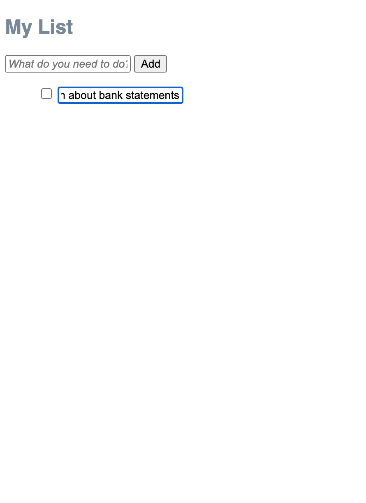

NCR Overall:
  * Missing many intermediate steps in design walkthrough
  * Some testing done
  * Some design iteration done
  * Not designed well for 360x640 screen
  * Missing Pull Request

XX NCR: You should have a header here and should have some introductory information as to what this document is about.  Who is designed what and why?

NCR: You were supposed to create a Pull Request and assign me as a reviewer.

NCR: What's this minus sign?
-alternative designs you considered, including images
any user testing you did
NCR: You can't refer to images on your local machine. They've got to be in the repository!
NCR: Only 3 images are shown. I can't understand the flow from this.
NCR: Looking at https://waverlywang7.github.io/cs124/Aemptylist.html with a 320x640 screen, the text and all the user interface elements are super tiny. How would a user on a phone use this?
NCR: You need intermediate images showing, for example, how the user is actually entering a new task. You just show before and after without the important intermediate steps.

Figure 1a.
At first, we considered an interface where you would begin with 5 empty blank input boxes. When we showed this in some user testing, we realized that it might cause some confusion of where to write your tasks. The user wouldn't know whether to use the input bar next to add or to write the task in the 5 empty blank boxes. It also brought up a question of what would happen if you checked a blank box to the user and we didn't want them to think about that.
Also, the number 5 was arbitrary and didn't give the user a chance to decide how many tasks there would be.

We were going to have a separate page for "Uncompleted Tasks", but we realized
the switching around of headings might cause confusion. We just wanted the interface to be on one page that would allow you to check or uncheck any of your tasks and would let the user hide or show completed/uncompleted tasks.
NCR: Sounds like you're trying to create tabs: here's an example of how that might look: https://www.w3.org/TR/wai-aria-practices-1.1/examples/tabs/tabs-2/tabs.html

Also, we realized once you checked uncompleted tasks, they would become completed and we would have to have them disappear from the "Uncompleted Tasks" page.

-the final design, including screen images and the flow for each task.
In an empty list, create an item named "Buy new John Grisham book"

Fig 1a.

Fig. 1b

We decided to create an interface where the empty list contains no elements and there is an input bar for the user to type in the item they would like to add. We also gave an option to show only completed
and only uncompleted tasks. When you hover over the words, they turn orange to signify they are clickable, and when you click on “show uncompleted tasks” or “show completed tasks”, the words turn orange to indicate that you are now on the uncompleted tasks or completed tasks page.
Fig.1a shows how the user would type into the input box to put in a task. They would then press “Add” and Fig. 1b  shows how the interface will look when a list item is put into a list.
In a non-empty list, create an item named "Eat Lunch"
Fig.2a BookFinal
This is what the non-empty list looks like before adding the item “Eat Lunch”.

Fig. 2b is what the list looks like after you add an element to a non-empty list - it creates an unchecked item underneath the preexisting items.
This will encourage the user to finish their older tasks first.
Mark the item named "Call Mom" completed (assumes there exists an item named "Call Mom")

.
Fig. 3a is what the screen looks like before marking “Call Mom” complete.

Fig. 3b is what the item “Call Mom” looks like after completing the task and clicking the checkbox. Once you complete your first item, the “delete completed items” button appears. Whenever there are completed items present in the list, the “delete completed items” button is present, and it disappears when completed items are cleared.
Rename the item "Text John" to "Text John about bank statements" (assumes there exists an item named "Text John").

Fig 4a. TextJohn1

Fig 4b. FTextJohnIntermediate1.png

Fig 4c. FTextJohnIntermediate2.png

Fig 4d. GTextJohnaboutBank

These pictures show how you would edit an existing item in your list. You click on the existing task by clicking on the words in fig 4a. Here you click "Text John" with your cursor. This will transform into the input box with the words you've already written inside it (4b). Then you can edit the text however you want (4c).You then click out of the input box into the white space around it to have the text return to normal like fig. 4d

Show only uncompleted items.
/Screen Shot 2021-09-22 at 4.03.53 PM.png)

Figure 5a: This is an example of a list of items, some marked complete and some uncompleted. We decided that when you click the checkbox for an item, it will cross out the item to indicate that it is complete. If the user wants to only view their uncompleted tasks, they can click to show uncompleted tasks, and it will hide the completed tasks.
We also have a button that appears called "Delete Completed Items" which will delete all completed items at once.

Figure 5b: The picture above is what the screen would look like when you hide completed tasks.
Delete all completed items.

This screen shows a list of completed items that have been checked off but not deleted. Note that when an item is checked, a strike-through line appears through the item to visually signify that it has been completed.

This screen shows a cleared list, aka an empty list, after clicking the “delete completed items” button. It becomes the original empty list that we started off with, and the “Delete Completed Items” button disappears, as there are no longer any completed items.

- challenges you faced
  One challenge we faced was figuring out the most user-friendly way to add functionality that deletes completed items. We had to organize our thinking and really put ourselves in the shoes of the user in order to come up with the best way to go about it. We also encountered inconsistencies among our different html pages, which we fixed by linking all of them to one style sheet.

-parts of the design you're most proud of
We’re most proud of the hide uncompleted tasks and show uncompleted tasks buttons, because they add extra functionality and give the user the option to either save their completed tasks and simply hide them from view, or delete their completed tasks. It’s a good feature because it’s intuitive and doesn’t cause confusion with the user. We’re also proud of the strikethrough feature when the user checks off an item, because it more thoroughly indicates that the user has completed the item and provides the same satisfaction as physically crossing off an item from a written to-do list.
