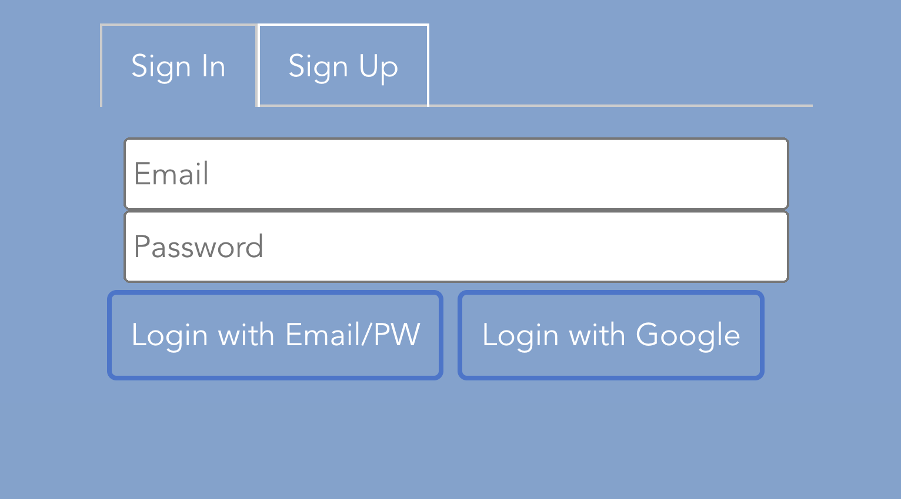
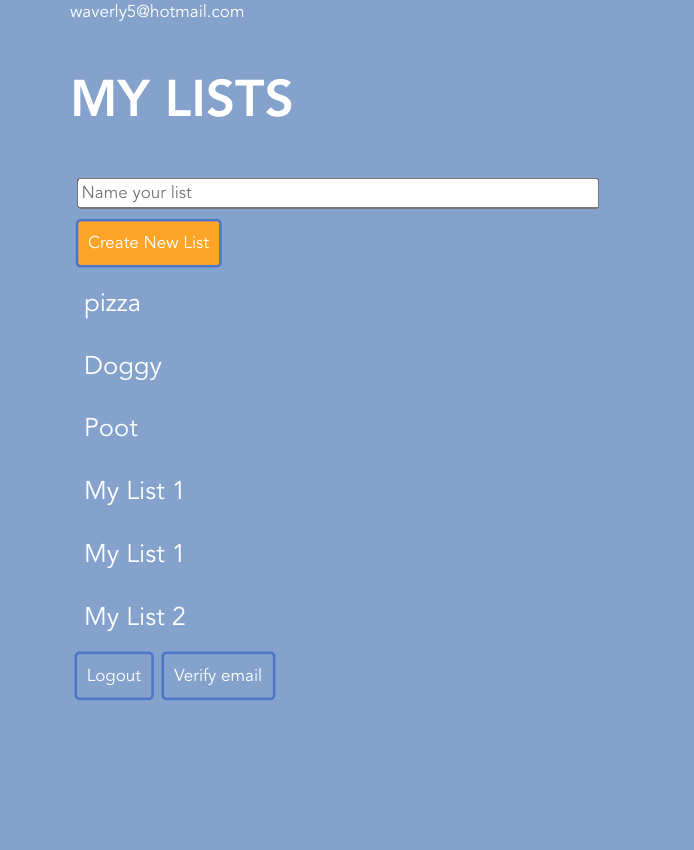
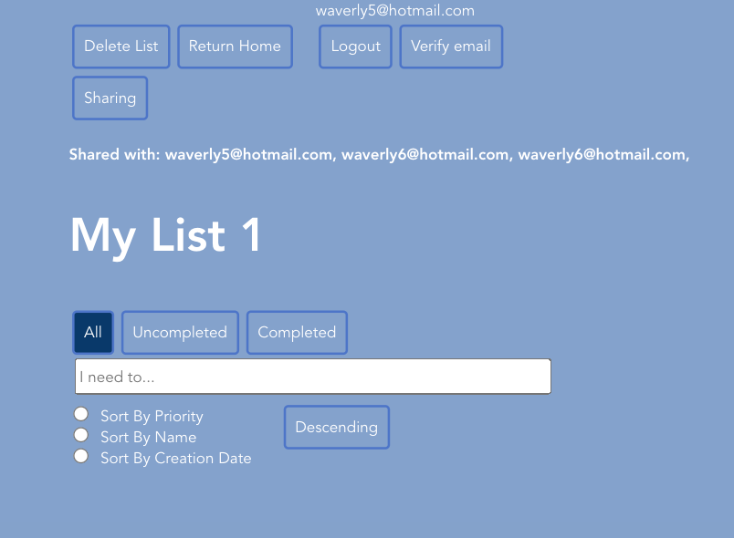
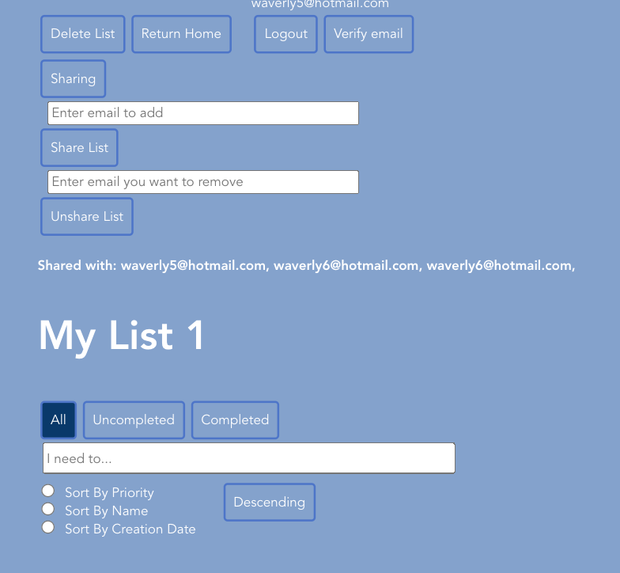
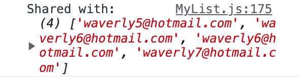

Ria Gopu
Waverly Wang
CS124

Lab 5
ALTERNATIVE DESIGNS

**Alternate design 1**

_Above is the first draft of our design from Lab1. We realized that this design was too small for 320x640  screen. The text and user interface was tiny on a phone. We were initially going to only have a button that said “Delete Completed Items” that would delete all completed items. It would only show up whenever there would be a completed item. Later, we realized we would want there to be an ability to delete either incomplete or completed items as people might want to trash either. We also didn't delete individual task functionality._

**Alternate Design 2**

Here was a rough design for our app later. We have the delete task. We expanded the text and made the buttons bigger. We decided to have the user only be able to delete a list item once they selected the task. The elements are still close together and we want to spread them out more. We also chose to have nicer colors rather than the white and blue.

**Alternate Design 3**

**Fig 1a**

_We increased the font and buttons so it was easier to touch. We also separated the buttons out so it’s not so visually cluttered._

**Fig 1b.**

_how the user would type into the input box to put in the task. They would click the “I need to” input box and type into the box. Then, press “Add”._

**Fig. 1c**

Fig. 1c shows how the interface will look after the item is put in the list. We let the user be able to edit their elements at all times.

**Alternate Design 4:**

We improved on the input bar so that when the user types in a task and presses “Add”, the input bar clears out any letters so that the user can type in a new task without having to press backspace several times. We also formatted the app so it was more intuitive for a 320x640 phone layout - stacking the buttons vertically rather than horizontally, and standardizing the size of the buttons. We made the buttons highlight with color when you pressed “Show Completed” and “Show Uncompleted” so you would know which one was selected. We also made the checkbox and fonts larger for easy use.
We made the delete task button so it only shows up when you select a task. The task can be completed or uncompleted when deleting. We also made the checkboxes bigger to easily check. We made the delete buttons red to clearly differentiate them. The buttons for show uncompleted items and show completed items will turn purple so you know which one you pressed.

**Alternate Design 4**

* We also added a feature where when there is nothing in the input bar, the add button will not show up! This will prevent the user from adding empty items. Once the input bar is empty after typing, the add button will disappear.

**Alternate Design 5**

Lab3fig1

lab3fig2
One feature we changed from alternate design 4 was “Delete all completed buttons'. Before our changes, it would appear even when there were no completed items. Now when there is only one task that is completed, the “Delete Task” button will appear and the “Delete all completed task” button will be hidden. Only when there is more than one task completed will the “Delete all completed task” button appear. We also added a feature where you can sort by different categories. The last feature we added was a priority dropdown, which allows the user to rank their task in priority before adding their task (and changing it afterwards). This is useful because the user can then click our “Sort by Priority” button and have their most pressing tasks be at the top of the screen. Another important change we made, that the user may not notice immediately, is that we implemented the app’s functionality with firebase rather than states. This allowed us to implement sorting easily and, most importantly, save the contents of the todo list upon reload or when closing and revisiting the app later.
We also added a feature on our app that lets you sort ascending or descending order.

For style changes, we decided to go with a blue screen since the dark purple was hard to read. We also made the tasks smaller so it was easier to read. We also made the buttons smaller and clustered together so they were associated together. Before, they were not aligned and took up the whole screen so you couldn’t view the tasks unless you were scrolling.

**Alternate Design 6 **

Here is what our new interface looks like for a list. The one major change was changing the sort button into radio buttons so you can see which sorting button you chose. And the order direction button has become a toggle button for ascending and descending.

* **TASK:** * Add support for multiple lists
  **Lab 4 Fig. 1**

Here is a picture of our new design. We created a page where you can create a list and see multiple lists. Here is

**Lab 4 Fig. 2**

Here it is with multiple lists.
* **TASK:** * Make application accessible
  **Lab 4 Fig. 3**

Here is a picture of the desktop version of our application zoomed in at 200%. All of the text and buttons are still visible at this size.

**Lab 4 Fig. 4**

Here is a picture of what happens when a user uses the tab button rather than their mouse to navigate the page: any modifiable/clickable element of the page is selectable. In this picture, a particular list is selected, and the user needs to hit the enter button in order to navigate into that list.

* **TASK:** * Add support for multiple screen sizes (desktop/mobile/landscape/portrait).

**Lab 4 Fig. 5**

Here is a picture of what the full desktop view looks like for our list of lists and lists page. As you can see, the input bar is larger than in the mobile view so you can see more of what you type.

**Lab 4 Fig. 6a.**

**Lab 4 Fig. 6b.**

Here is a picture of what the mobile portrait view looks like for our multiple lists and singular list page.
As you can see the input bar of the list items and the input bar has become smaller in reaction to becoming smaller.

**Lab 4 Fig. 7a.**

**Lab 4 Fig. 7b.**

Here are pictures of what the mobile landscape view looks like for our list of lists and singular list. The user can scroll up and down to view the “Delete List” and “Return Home” buttons. As you can see, the input bar is larger than in the mobile view so you can see more of what you type.

**TASK:**  Keyboard Accessibility and Screen Reader

Here is a link to a video showing how you can access the functionality of our app without a keyboard and how the screen reader is able to read out-loud.
https://www.youtube.com/watch?v=m79B8PYgvNY

We added aria-labels on the checkboxes so it says “You have selected… [name of task]” so you know what the checkbox corresponds to.

We also added an aria-label on the priority dropdown that tells the user “This is a priority dropdown. The options are low, medium and high” . Before it simply said “low” to announce the option selected.

We also added an aria label on the order toggle button so is says “You are on the descending button. This is a toggle button between Ascending and Descending”. This provided more information than announcing “Descending button”

**Below is a workflow for each task. The workflow for Alternate Design 5 and our final design is the same so we kept the pictures from lab 2 and lab 3. We only updated the task workflows that changed from lab2**

** FINAL DESIGN LAB 5 **
**Lab 5 Fig. 1**

Here is our final design. Here is what it looks like for login. We have a sign in and sign up tab. The user can sign in or sign up with an email and password. You can also sign up with Google.

**Lab 5 Fig. 2**

Here is what our list of lists look like.You can logout and verify email. We also put the email of the user at the top.

**Lab 5 Fig. 3**

Here is what our singular list page looks like. You can say your email at the top. We added a Sharing button which you can click to reveal an input bar to share and unshare. There is also a list of emails of people you have shared with.

We added the ability to share a list by typing in an email and clicking share list.

**Lab 5 Fig. 4**

Here is a task flow for sharing and unsharing. You type in the email you want to share and once you click submit it will show up in the “Shared with” list.
To unshare, you type an email that you want to remove and click the “Unshare List” button.
**Lab 5 Fig. 5**

We can console.log the array called “sharedWith” which is all of the emails you are sharing with. There is also console.log telling you you cannot share with yourself and you will not be added to the “sharedWith” array.
We also have console.log saying you cannot remove sharing from yourself.

Here are our design decisions for sharing:

A shared task list is editable by either the original owner or by a user it is shared with. They can delete and add tasks and have read/write access.

If user A shares a list with user B, can user B share that list with user C?
User B cannot.
No, User B cannot because they are not the owner.

If user A shares a list with user B, can user B delete that list?
No. B will get a permissions error because user B is not the owner of the list.

If user A shares a list with user B, does user B need to accept that sharing, or will a shared list just show up?
The shared list will just show up in their list of lists. The User B doesn’t have to share with User A to see what User A shared with User B. User B doesn’t have to be the owner of the list User A shared.

Should shared lists be distinguishable in the UI from unshared lists?
Yes, you can see what emails you shared with as seen above.

If user A shares a list with user B, can user B see that list if they don't have a verified email address?
Yes, they can see without a verified email address.

* **TASK:** In a empty list, create an item named “Buy new John Grisham Book”

**Fig 2a**

_Fig 2a shows what the interface looks like when it’s empty. As you can see, we increased the font and buttons so it was easier to use. Notice “Add” button doesn’t show so you can’t add empty items._

**Fig 2b**

_Fig 2b how the user would type into the input box to put in the task. They would click the “I need to” input box and type into the box. Then, press “Add”._

**Fig 2c**

_Fig. 2c shows how the interface will look after the item is put in the list. We let the user be able to edit their elements at all times. Notice how the input bar is now blank so that the user can write their next task without backspacing to write their next task._

* **TASK:** In a non-empty list, create an item named “eat lunch”

**Fig 3a.**

_Fig 3a shows what the interface looks like when it’s a non-empty list._

**Fig 3b**

_Fig. 3b Shows what typing in eat lunch looks like._

**Fig 3c**

_Fig 3c. shows how the added task is put to the bottom of the list. This will help the viewer see their oldest to do list items first so they are encouraged to get older to do list items done._

* **TASK:** Mark the Item named “Call Mom” Completed
  **Fig. lab34a**
  
  _Fig. 4a shows what it looks like before marking the “call mom” item
  Completed. Note how the “delete all completed tasks” button isn’t showing.

**Fig. lab34b**

_4b shows what it looks like after marking the “Call Mom” Completed. Notice how once you click the checkmark, the “Delete Task” button is showing. Notice the “Delete All completed tasks” button isn’t showing. When you check only one box, the “Delete Task” button will show up. If you check more than one box, the “delete all” button will show.

* **TASK:** Rename the item “Text John” to “Text John about Bank Statements”

**Fig. 5a**

_Fig. 5a what it looks like when there is a “Text John” item in the list._

**Fig. 5b**

_Fig 5b shows what it looks like when you are in the process of editing “Text John about Bank Statements”.
The user would click on the “Text John” element and type in their edit. We made all the task elements editable at all times._

**Fig. 5c**

_Fig. 5c shows what it looks like after the user has finished editing their task._

* **TASK:** Show only uncompleted items

**Fig. 6a**

_Fig. 6a shows what it looks like when there is a variety of completed and uncompleted elements. Notice that the "My List" title is no longer visible; that is because we have scrolled down in the page in order to view all of the list items._

**Fig. 6b**

_The user would click on the “Show Uncompleted” button, and then the button would be highlighted so the user know what filter is on. The elements that are uncompleted are not showing now. The other tasks are still accessible by clicking “Show Completed” and “Show All”. “Show Completed” will show only completed tasks and hide “Uncompleted Tasks”. “Show All” will let you see both incomplete and completed tasks._

* **TASK:** Delete all completed items.

**Fig. 7a**

lab3fig6a
_This is what it looks like before “Delete All completed tasks”. Here we have a variety of complete and incomplete tasks. “Delete All Completed Tasks” button would be present at the bottom of the screen. Since we have more than one task completed _

**Fig. 7b**
lab3fig6b
_The user would press “Delete All Completed Tasks” and the completed tasks would be removed. They are removed and no longer accessible to the user. Notice the “Delete All completed” button is hidden now that there are no completed tasks. _

**USER TESTING**
Draft of Final Design
User A
Was able to easily add titles and add list items easily

User B
Was able to easily add items to lists.
Thought the toggle button was hard to understand and suggested we have something that highlights in color when the selected direction is chosen.
asked how it would work if you don’t want to sort by any order.
User C
Suggested that our share list button didn’t need to be displayed all the time, and that we could toggle a general sharing button based on whether we wanted to share/unshare something.

**CHALLENGES WE FACED:**
One challenge we faced was enabling sharing; we were very confused about how to access the array we created, containing emails that the list has been shared with, because it was hard to access the fields of a particular document in firebase. Once we figured that out, we struggled with actually displaying the list in the account of the user that it had been shared with, but eventually we were able to figure that out as well.

**PARTS OF THE DESIGN WE’RE MOST PROUD OF:**
We’re most proud of our unshare feature, that allows you to remove sharing with a particular email address if you want to make your list private. We’re also proud of our feature that displays the email addresses of all of the people you’ve shared the list with.

