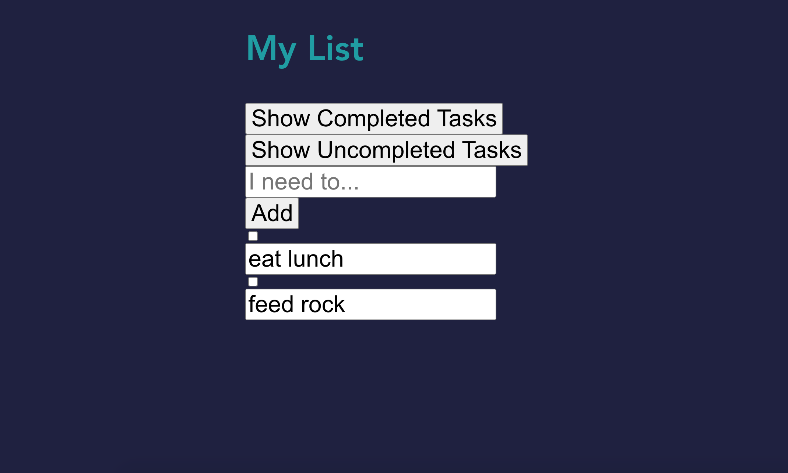

<<<<<<< HEAD

=======
ALTERNATIVE DESIGNS

**Alternate design 1**

_Above is the first draft of our design from Lab1. We realized that this design was too small for 320x640  screen. The text and user interface was tiny on a phone. We were initially going to only have a button that said “Delete Completed Items” that would delete all completed items. It would only show up whenever there would be a completed item. Later, we realized we would want there to be an ability to delete either incomplete or completed items as people might want to trash either. We also didn't delete individual task functionality._

**Alternate Design 2**

Here was a rough design for our app later. We have the delete task. We expanded the text and made the buttons bigger. We decided to have the user only be able to delete a list item once they selected the task. The elements are still close together and we want to spread them out more. We also chose to have nicer colors rather than the white and blue.

**Alternate Design 3**

**Fig 1a**

_We increased the font and buttons so it was easier to touch. We also separated the buttons out so it’s not so visually cluttered._

**Fig 1b.**

_how the user would type into the input box to put in the task. They would click the “I need to” input box and type into the box. Then, press “Add”._

**Fig. 1c**

Fig. 1c shows how the interface will look after the item is put in the list. We let the user be able to edit their elements at all times.

**FINAL DESIGN NOTES:**

We improved on the input bar so that when the user types in a task and presses “Add”, the input bar clears out any letters so that the user can type in a new task without having to press backspace several times. We also formatted the app so it was more intuitive for a 320x640 phone layout - stacking the buttons vertically rather than horizontally, and standardizing the size of the buttons. We made the buttons highlight with color when you pressed “Show Completed” and “Show Uncompleted” so you would know which one was selected. We also made the checkbox and fonts larger for easy use.
We made the delete task button so it only shows up when you select a task. The task can be completed or uncompleted when deleting. We also made the checkboxes bigger to easily check. We made the delete buttons red to clearly differentiate them. The buttons for show uncompleted items and show completed items will turn purple so you know which one you pressed.

**Final Design Features**

* We decided to create an interface where the empty list contains no elements. We also added a feature where when there is nothing in the input bar, the add button will not show up! This will prevent the user from adding empty items. Once the input bar is empty after typing, the add button will disappear.

* **TASK:** In a empty list, create an item named “Buy new John Grisham Book”

**Fig 2a**

_Fig 2a shows what the interface looks like when it’s empty. As you can see, we increased the font and buttons so it was easier to use. Notice “Add” button doesn’t show so you can’t add empty items._

**Fig 2b**

_Fig 2b how the user would type into the input box to put in the task. They would click the “I need to” input box and type into the box. Then, press “Add”._

**Fig 2c**

_Fig. 2c shows how the interface will look after the item is put in the list. We let the user be able to edit their elements at all times. Notice how the input bar is now blank so that the user can write their next task without backspacing to write their next task._

* **TASK:** In a non-empty list, create an item named “eat lunch”

**Fig 3a.**

_Fig 3a shows what the interface looks like when it’s a non-empty list._

**Fig 3b**

_Fig. 3b Shows what typing in eat lunch looks like._

**Fig 3c**

_Fig 3c. shows how the added task is put to the bottom of the list. This will help the viewer see their oldest to do list items first so they are encouraged to get older to do list items done._

* **TASK:** Mark the Item named “Call Mom” Completed
**Fig. 4a**

_Fig. 4a shows what it looks like before marking the “call mom” item completed._

**Fig. 4b**

_4b shows what it looks like after marking the “Call Mom” Completed. Notice how once you click the checkmark, the “Delete Task” button is showing. This is because once you click any part of the task item (the checkbox or input box), the “Delete Task” button will show up. So selecting can be done by clicking the checkbox. This way you can delete even uncompleted tasks. This covers cases where a user writes a task that they later realize they don’t want._

* **TASK:** Rename the item “Text John” to “Text John about Bank Statements” 

**Fig. 5a**

_Fig. 5a what it looks like when there is a “Text John” item in the list._

**Fig. 5b**

_Fig 5b shows what it looks like when you are in the process of editing “Text John about Bank Statements”. 
The user would click on the “Text John” element and type in their edit. We made all the task elements editable at all times._

**Fig. 5c**

_Fig. 5c shows what it looks like after the user has finished editing their task._

* **TASK:** Show only uncompleted items

**Fig. 6a**

_Fig. 6a shows what it looks like when there is a variety of completed and uncompleted elements. Notice that the "My List" title is no longer visible; that is because we have scrolled down in the page in order to view all of the list items._

**Fig. 6b**

_The user would click on the “Show Uncompleted” button, and then the button would be highlighted so the user know what filter is on. The elements that are uncompleted are not showing now. The other tasks are still accessible by clicking “Show Completed” and “Show All”. “Show Completed” will show only completed tasks and hide “Uncompleted Tasks”. “Show All” will let you see both incomplete and completed tasks._

* **TASK:** Delete all completed items.

**Fig. 7a**

_This is what it looks like before “Delete All completed tasks”. Here we have a variety of complete and incomplete tasks. “Delete All Completed Tasks” button would be present at the bottom of the screen._

**Fig. 7b**

_The user would press “Delete All Completed Tasks” and the completed tasks would be removed. They are removed and no longer accessible to the user._

**Fig. 7c**

_Now, when the user presses "Show Completed", there will be no tasks, because we have just deleted all of them._

**USER TESTING**

**User A:**

_Alternate Design 2_

*Note: we already had some initial tasks written out.
* User A would add items by clicking add and editing the list item in the list.
* It was only later that the user figured out that the “I need to” input box is where you can put in the todo list item.
User A is annoyed by the checkboxes above the lists because a large list would make it hard to know which checkboxes refer to which list items.

_Alternate Design 3_
* UserA did not notice that they were on the “Show Completed tasks” until reminded, so the added tasks didn’t show up, which confused them. 
* They suggested using some form of alert.
* They can easily add tasks and they were amazed by the categorization of the “Show completed” and “Show Uncompleted Tasks”

**User B:**

_Alternate Design 2_

*Note: we already had initial tasks written out.
* User B was hesitant/confused at first regarding where to write their task.
* User B quickly found the “I need to” input box and wrote some tasks.
They easily added and deleted tasks :)

_Alternate Design 3_
* B was able to add things easily and found it easy to toggle between the complete and uncompleted tasks. They suggested being able to click “enter” to add.

**User C: Alternate Design 3** 

* User C suggested that the Add button only shows up when the user has typed in the input box in order to prevent adding blank items.
* User C thought it would be nice if the "delete all completed tasks" button only appeared when there were completed tasks to be deleted.
* They liked the scrolling feature of the app once items go off the page.

**User D: Alternate Design 3**

* User D was able to add elements easily with input bar, delete items, toggle between tabs 
* They suggested that capitalize and uncapitalized items that are identical could be seen as the same task.
said the position of “delete all completed tasks” is a little awkward since it’s so large.
* Suggested a green color for Delete Task as that is more positive color than red.
* Suggested removing the word “tasks” as it was redundant.
* Suggested making show completed tasks green and making show uncompleted tasks = red because it suggests it is bad you haven’t done it.
* They like the “I need to…” suggestion in the input bar. They suggested renaming MyList to something else, or allow the user to edit it. 
* Also suggested removing the word “Show” from various buttons, as that is already implied.

_Decisions Made After User Testing:_

After hearing User A’s feedback, we realized that there is some ambiguity in regards to where to input the list item. After hearing User B’s feedback, we realized that the initial tasks are what are confusing people. It makes people think that you edit the task after you add a blank task rather than writing in the “I need to” input box. Both User A and User B’s input inspired us to  incorporate some indication that the task is done being edited, like adding a functionality that causes the task to turn solid rather than editable after the user clicks outside the box. Their input also inspired us to make the task items smaller than the input box, directing users’ attention to the input box rather than the task list. User D’s feedback was great for implementing a better and more intuitive layout and color scheme to ensure a more positive experience for the user (for example, turning the delete button green, as deleting completed tasks should feel satisfying and rewarding), and helped us eliminate redundant words so we don’t over-explain the interface to the user with over-descriptive naming of buttons (for example, removing the word “tasks” from several of our buttons, as it is implied).  User C’s advice helped with refining the app so the “add” button and “delete” button would only show up when needed.

**CHALLENGES WE FACED:** 

We faced several challenges during the process of building this app. As neither of us had experience with React prior to this assignment, we were quite lost in terms of laying the foundations and adding more complex features to the app. Keeping track of all the components, how they are used, and the scopes in which they can and can’t be used was quite challenging, and certain concepts, like how exactly to use props, were difficult to grasp completely in the beginning. Since several states and variables controlled similar (but not the same) things, it was quite confusing keeping track of which ones to modify/use at which points. However, we were able to overcome these challenges by revisiting earlier lectures on these topics, referring to old in-class assignments that used similar functionalities, and going to office hours for clarification.

**PARTS OF THE DESIGN WE’RE MOST PROUD OF:** 

We are most proud of the simple, intuitive layout of the app - it isn’t overly cluttered and has nice colors. We also are proud of our Add Button, specifically how it only shows up once the user types, which ensures that the user cannot add empty list items. We thought this was an elegant solution because it does not require any alerts or unnecessary error messages for the user, and simply directs them away from inputting empty list items. 
>>>>>>> 3ebd9ed1607a668a7ee5374de4ed146e84f226e2
